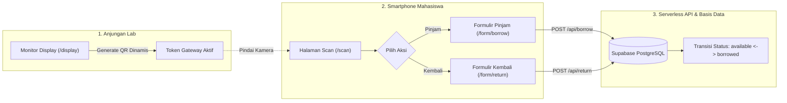

# MASTER TEST PLAN (IEEE 829 / ISO 29119)
## SISTEM SASARAN: LENTERA (LABORATORY ASSET LENDING & TRACKING SYSTEM)
> **Branch Audit:** `qa/ppl-audit`  
> **Target Repositori:** https://github.com/openc-dev/lentera  
> **Mata Kuliah:** Pengujian Perangkat Lunak (KB260004 &middot; 2 SKS)  
> **Program Studi:** Teknologi Rekayasa Multimedia (TRM3A1) &middot; TA 2026/2027  
> **Dosen Pengampu:** Charmiyanti Nurkentjana Aju, S.Kom., M.Kom.  

---

### IDENTITAS TIM PENGUJI (KELOMPOK 1)

1. **Mu'adz Hudzaifah (NPM: 24903460014)**
   - **Peran:** Perancang Arsitektur Pengujian & Automasi (Lead Test Architect)
   - **Wilayah Kerja:** `@tests/`
   - **Fokus Tanggung Jawab:** Perancangan Master Test Plan, automasi pengujian API/E2E, simulasi konkurensi (race condition), evaluasi keamanan token gateway, dan integrasi pipeline.
2. **Zahraan Dzakii Ts. (NPM: 24903460011)**
   - **Peran:** Analis Alur Sistem & White-Box (Senior Systems Analyst)
   - **Wilayah Kerja:** `@audit/`
   - **Fokus Tanggung Jawab:** Rekonstruksi diagram alur data (Sequence, Activity, Use Case) dalam sintaks Mermaid, pengujian White Box (Basis Path Testing & Cyclomatic Complexity $V(G)$), dan integritas aturan basis data.
3. **Syifa Amelia (NPM: 24903460001)**
   - **Peran:** Analis Pengujian Fungsional & Advokat Pengguna (Lead Functional QA)
   - **Wilayah Kerja:** Web GitHub Issues & `@reports/`
   - **Fokus Tanggung Jawab:** Perancangan skenario kasus uji Black Box (Boundary Value Analysis & Equivalence Partitioning), pengujian eksploratori pada antarmuka web Lentera, pencatatan tiket cacat (Bug Reports), dan User Acceptance Testing (SUS scale).

---

### 1. PROFIL SISTEM SASARAN
`Lentera` adalah sistem otomasi peminjaman dan pelacakan inventaris laboratorium berbasis anjungan mandiri (*self-service kiosk*) terintegrasi dengan peramban seluler mahasiswa.

#### Spesifikasi Teknologi (Tech Stack)
- **Frontend & Kiosk Engine:** Next.js 16, React 19, TypeScript, Tailwind CSS v4 (`lentera-frontend/`).
- **Backend & API Engine:** Laravel 11 / Next.js Serverless Route Handlers (`lentera-backend/`).
- **Database & Identity:** Supabase PostgreSQL, Row Level Security (RLS).
- **Infrastruktur Produksi:** Vercel Edge / Serverless Network.

#### Karakteristik Khusus Pengujian
1. **State Machine Deterministik:** Status aset bergerak dalam siklus tertutup (`available` $\leftrightarrow$ `borrowed`).
2. **Dual-Screen Kiosk Gateway:** Sinkronisasi visual monitor anjungan lab (`/display`) dengan peramban ponsel mahasiswa (`/scan`).
3. **Integritas Transaksi Bersamaan:** Memerlukan proteksi basis data agar satu aset tidak dapat dipinjam oleh dua mahasiswa pada detik yang sama (*concurrency race condition*).

---

### 2. DEKONSTRUKSI BISNIS PROSES (REVERSE ENGINEERING)



1. **Kiosk Gateway Session & QR Token Rotation:** Pengujian masa berlaku token (TTL), pencegahan *replay attack*, dan *direct URL guards*.
2. **Peminjaman Mandiri Alat (Self-Service Borrowing):** Validasi format NPM, durasi jam pinjam, dan transisi status aset wajib `available`.
3. **Pengembalian Mandiri Alat (Self-Service Return):** Pencocokan NPM peminjam asli, pembatasan akses pengembalian ilegal, dan penutupan transaksi.
4. **Manajemen Inventaris & Kontrol Otoritas Admin:** Proteksi otentikasi laboran dan audit log riwayat transaksi.

---

### 3. METODOLOGI & DIMENSI PENGUJIAN

#### A. Black Box Testing (Pengujian Fungsional Eksternal - Syifa Amelia)
- **Equivalence Partitioning & Boundary Value Analysis (BVA):** Uji batas input NPM (min/max 11 digit, karakter alfabet, karakter spesial) dan durasi jam pinjam.
- **State Transition Testing:** Memverifikasi penolakan sistem terhadap upaya peminjaman barang yang berstatus `borrowed` atau `maintenance`.

#### B. White Box Testing (Pengujian Logika Internal - Zahraan Dzakii Ts.)
- **Basis Path Testing & Cyclomatic Complexity:** Menghitung nilai $V(G) = E - N + 2P$ pada fungsi validasi form dan route handlers di `@audit/specs/cyclomatic_complexity.md`.

#### C. Integration & Concurrency Testing (Automasi Mesin - Mu'adz Hudzaifah)
- **API Status Contracts:** Validasi kode status HTTP (200 OK, 400 Bad Request, 401 Unauthorized, 409 Conflict) di `@tests/api/`.
- **Concurrency / Race Condition Benchmark:** Skrip automasi penembakan permintaan paralel simultan pada aset tunggal di `@tests/concurrency/`.

#### D. User Acceptance Testing (UAT - Tim Kelompok 1)
- Pengukuran efisiensi alur peminjaman oleh 5–10 mahasiswa menggunakan instrumen kuesioner baku *System Usability Scale (SUS)* di `@reports/pertemuan-11/`.

---

### 4. ROADMAP PENGUJIAN 13 PERTEMUAN KULIAH

| Pertemuan | Materi Silabus Perkuliahan | Target Deliverable Kelompok 1 Lentera |
|---|---|---|
| **1** | Pendahuluan Testing & Implementasi Software | Pembentukan tim dan orientasi standar mutu ISO 29119. |
| **2** | Dasar-dasar Kualitas Perangkat Lunak & Testing | Penetapan platform Lentera & perancangan TEST_PLAN.md. |
| **3** | Reverse Engineering & Manajemen Kualitas | **Pemaparan Sistem Lentera, Use Case & Sequence Diagram (`@reports/pertemuan-03`).** |
| **4** | Isu Seputar Testing & Testability | Analisis testability arsitektur hybrid (kiosk vs client form) di `@audit/specs`. |
| **5** | Testability Environment & Data Staging | Setup test fixtures (`@tests/fixtures`) dan mock data alat lab. |
| **6** | Software Testing Strategy & Test Core | Matriks pengujian Black Box (BVA & Equivalence Partitioning) di `@reports/pertemuan-06`. |
| **7** | Studi Kasus Program/Software yang Buggy | Eksplorasi bug potensial (race condition token, direct access) & penerbitan GitHub Issues. |
| **8** | **UTS: Implementasi Unit Testing** | Suite Unit Test pada helper validasi input NPM dan token generator di `@tests/unit`. |
| **9** | Prosedural Testing & Integration Testing | Pengujian integrasi API endpoint (`/api/borrow`, `/api/return`) di `@tests/api`. |
| **10** | Software Testing Documentation | Requirements Traceability Matrix (RTM) dan Test Execution Logs terpadu. |
| **11** | System Acceptance Test (UAT) | Pelaksanaan UAT bersama mahasiswa menggunakan instrumen kuesioner SUS. |
| **12** | Strategi Implementasi & CI Automasi | Konfigurasi GitHub Actions Automated Testing sebelum rilis audit. |
| **13** | **UAS: Maintenance & Final Audit Report** | Penyerahan Laporan Akhir Audit Mutu lengkap (Bab 1–5) dan penutupan tiket bug. |

---

### 5. STRUKTUR REPOSITORI & KAVLING KERJA

```text
lentera/ (Branch: qa/ppl-audit)
├── README.md               <-- Profil audit resmi repositori
├── TEST_PLAN.md            <-- Master Test Plan acuan seluruh tim
├── AGENTS.md               <-- Master Agent Directive untuk seluruh AI
│
├── audit/                  <-- [KAVLING ZAHRAAN] Diagram Mermaid & Spesifikasi Aturan
│   ├── AGENTS.md
│   ├── diagrams/           <-- Sequence, Activity, State diagrams
│   └── specs/              <-- Aturan bisnis & batas nilai input BVA/EP
│
├── tests/                  <-- [KAVLING MU'ADZ] Executable Tests & Automasi
│   ├── AGENTS.md
│   ├── unit/               <-- Unit tests
│   ├── api/                <-- API integration tests
│   ├── concurrency/        <-- Race condition simulation
│   └── fixtures/           <-- Mock data SQL seed
│
└── reports/                <-- [ETALASE BERSAMA] Arsip Laporan & Slide Mingguan
    ├── AGENTS.md
    └── pertemuan-03/       <-- Laporan dan slide pertemuan minggu ini
        ├── LAPORAN_P3.md
        └── SLIDES_P3.md
```
