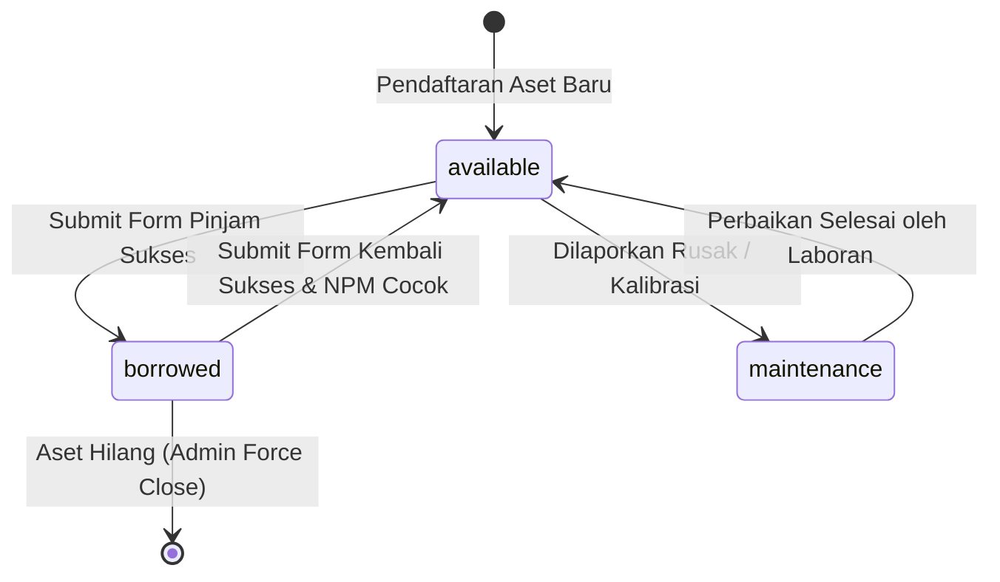

# SPESIFIKASI ATURAN BISNIS & BATAS NILAI INPUT (BVA/EP)
> **Modul Target:** Formulir Peminjaman & Pengembalian Aset Lentera  
> **Penyusun:** Zahraan Dzakii Ts. &middot; *Senior Systems Analyst*  
> **Status:** Acuan Resmi Pengujian Black Box & Unit Testing  

---

## 1. ATURAN INPUT FORMULIR PEMINJAMAN (`/form/borrow`)

| Nama Kolom | Tipe Data | Batas Nilai / Karakter (BVA) | Partisi Ekuivalensi (Valid vs Invalid) | Tindakan Sistem |
|---|---|---|---|---|
| **NPM Mahasiswa** | String Numerik | Panjang tepat: **11 digit** Batas: 10 digit (min-1), 11 digit (valid), 12 digit (max+1) | **Valid:** `24903460014` **Invalid:** `12345` (kurang), `ABC12345678` (huruf), `2490346001499` (lebih) | Wajib tolak dengan pesan: *"NPM wajib berupa 11 digit angka"* |
| **Nama Lengkap** | String Alfabet | Minimal 3 karakter, maksimal 60 karakter | **Valid:** `Mu'adz Hudzaifah` **Invalid:** `A` (terlalu pendek), simbol berbahaya `<script>` | Sanitasi karakter berbahaya & tolak input < 3 char |
| **Program Studi** | Enum | Terdaftar dalam: TRM, IF, SRK, MEKA | **Valid:** Salah satu opsi terpilih **Invalid:** String kosong (unselected) | Validasi select dropdown wajib dipilih |
| **Mata Kuliah** | String | Minimal 4 karakter | **Valid:** `Praktikum Multimedia` **Invalid:** Kosong / spasi saja | Wajib diisi |
| **Pilihan Aset** | UUID / ID Aset | Status aset wajib: `available` | **Valid:** ID barang berstatus `available` **Invalid:** ID barang berstatus `borrowed` / `maintenance` | Tombol disabled / tolak dengan HTTP 409 Conflict |

---

## 2. ATURAN STATUS TRANSISI SIKLUS HIDUP ASET (STATE MACHINE)

- **Invarian Sistem:** Aset yang sedang berstatus `borrowed` TIDAK BOLEH dapat dipilih pada formulir peminjaman.
- **Guard Pengembalian:** Pengembalian hanya sah jika NPM yang diinputkan sama dengan NPM peminjam transaksi aktif.
